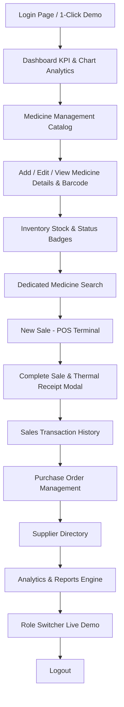

# PharmaCare PRO - Pharmacy Management System Prototype
**System Analysis & Design (SAD) Lab Project Presentation Prototype**

---

## 📌 Project Overview
PharmaCare PRO is a modern, professional, interactive **Pharmacy Management System Prototype** engineered for university **System Analysis and Design (SAD)** lab demonstrations. 

It showcases the user interface, navigation workflows, role-based controls, POS checkout, stock management, and reporting analytics of a pharmacy software platform.

---

## 🛠 Tech Stack
* **Frontend**: HTML5, Vanilla Modern CSS (Tailored Healthcare Teal/Emerald Design System), JavaScript (ES6+), FontAwesome 6, Chart.js 4.
* **Backend Engine**: PHP (Compatible with PHP 7.4 - 8.3+).
* **Database**: MySQL via XAMPP (Apache + phpMyAdmin).

---

## 🚀 XAMPP & Local Setup Instructions

### Step 1: Copy Project Folder to XAMPP `htdocs`
1. Open XAMPP Control Panel and start **Apache** and **MySQL**.
2. Copy the `pharmacy_management_prototype` folder into your XAMPP `htdocs` directory:
   ```
   C:\xampp\htdocs\pharmacy_management_prototype
   ```

### Step 2: Import Database in phpMyAdmin
1. Open your browser and navigate to: `http://localhost/phpmyadmin/`
2. Click **Databases** tab and create a new database named `pharmacy_management`.
3. Select `pharmacy_management` database and click **Import** tab.
4. Click **Choose File** and select `pharmacy_management.sql` located inside:
   ```
   d:/pharmacy_management_prototype/database/pharmacy_management.sql
   ```
5. Click **Import** at the bottom to seed default tables and sample records.

> **Note**: The prototype also features an offline fallback engine (`includes/db_helper.php`) so that even if MySQL is disconnected during initial preview, all pages render complete data.

### Step 3: Run the Application
Access the app in your browser:
```url
http://localhost/pharmacy_management_prototype/
```

---

## 🔑 Default Login Credentials

| Role | Username | Default Password | Access Level |
| :--- | :--- | :--- | :--- |
| **Admin** | `admin` | `password123` | Full Access (Dashboard, Medicines, Inventory, Sales, Purchases, Suppliers, Staff, Reports) |
| **Pharmacist** | `pharmacist` | `password123` | Operational Access (Dashboard, Search, Check Stock, Create Sale POS, Sales History, Purchase Info) |
| **Staff** | `staff1` | `password123` | Counter Staff Access |

> ⚡ **Presentation Shortcut**: On the Login screen, click **"Admin Role"** or **"Staff / Pharmacist"** under *Quick Demo Logins* to log in instantly with 1 click!

---

## 🎬 Presentation Workflow (For University Lab Presentation)

Follow this presentation sequence to demonstrate the complete workflow to your instructor:



1. **Login Interface**: Demonstrate authentication and 1-Click presentation logins.
2. **Dashboard**: Highlight KPI stat cards (Total Medicines, Low Stock, Expired, Today's Sales, Purchases, Suppliers, Staff), Chart.js revenue trends, stock distribution, and low-stock alerts.
3. **Medicine Management**: Show searching, category filters, and opening medicine profile with GTIN-13 barcode visual.
4. **Inventory Control**: Show status badges (*In Stock*, *Low Stock*, *Out of Stock*, *Expired*) and click **Adjust Stock Qty**.
5. **POS Register (`sales/new_sale.php`)**: Add medicines to cart, adjust quantities, apply discount, select payment method, click **Complete Sale** to trigger printable thermal receipt modal.
6. **Purchases & Suppliers**: Show vendor purchase orders ledger and supplier directory.
7. **Reports Engine**: Switch between Sales, Purchase, Inventory, Expiry, and Low Stock tabs; filter by date.
8. **Live Role Switcher**: Click **"Role: Admin/Pharmacist Mode"** button in top navbar to switch views live without logging out!

---

## 📄 System Analysis & Design (SAD) Scope Notes

### Executed Prototype Functionalities
* UI/UX Design & Navigation Architecture
* Master Medicine Cataloging & Barcode Mocking
* POS Sales Terminal & Thermal Invoice Generator
* Low Stock & Expiry Visual Warning Engine
* Role-based Menu Control & Role Switcher
* Sample Analytics Dashboard & Export Simulation

### Future Production Implementation Scope
* Hardware Barcode Scanner Integration
* Payment Gateway API Integration (bKash/SSLCommerz/Card Terminal)
* Automated SMS Expiry & Stock Reorder Alerts
* Advanced Database Indexing & Security Hashing

---

## 📁 Directory Structure
```
pharmacy_management_prototype/
├── index.php                 # Entry redirect handler
├── login.php                 # Auth page with quick presentation logins
├── forgot_password.php       # Password reset interface demo
├── dashboard.php             # Main Analytics & KPI Dashboard
├── config/
│   └── database.php          # MySQL PDO configuration
├── includes/
│   ├── header.php            # HTML head, FontAwesome, Chart.js
│   ├── navbar.php            # Topbar with global search & role switcher
│   ├── sidebar.php           # Role-based menu navigation
│   ├── footer.php            # Footer, modal, and toast containers
│   └── db_helper.php         # DB queries & offline fallback engine
├── css/
│   └── style.css             # Modern Healthcare Design System
├── js/
│   └── script.js             # POS cart, table filters, thermal receipts
├── database/
│   └── pharmacy_management.sql # Complete SQL Schema & seed data
├── medicines/                # Medicine catalog, add, edit, details
├── inventory/                # Inventory stock control dashboard
├── sales/                    # POS sale register & transaction history
├── purchases/                # Purchase orders & stock entry
├── suppliers/                # Vendor management directory
├── staff/                    # Employee roster & permission management
├── reports/                  # Analytics, charts, & tabbed reports
├── search/                   # Fast medicine lookup tool
└── profile/                  # User profile & credentials editor
```
